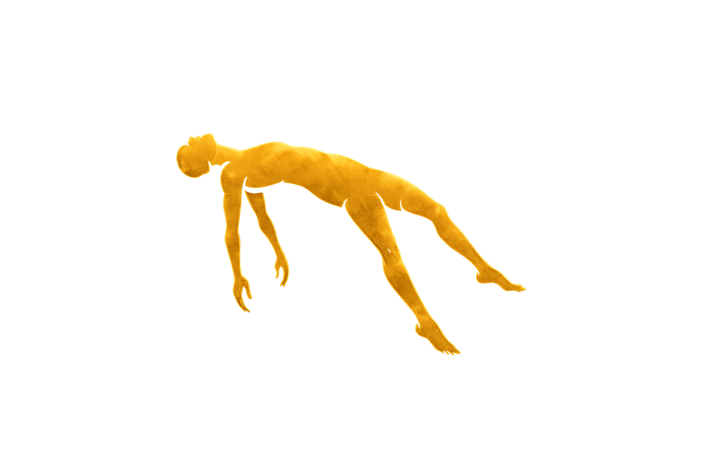

# CONTEXTO PROYECTO ELEVÉ — Para nueva sesión

## El proyecto
Sitio web premium para **ELEVÉ** (con acento) — tienda de **concentrados de THC** (destilados, live resin, shatter, rosin, diamonds) y **vaporizadores**. Archivo principal: `C:\Users\danie\OneDrive\Escritorio\Agente P\eleve.html`

---

## Stack
HTML + CSS + JS vanilla, sin frameworks ni librerías externas.
Fuentes Google: `Bebas Neue` + `Playfair Display` + `Space Grotesk`

---

## Paleta de colores
| Variable | Valor | Uso |
|---|---|---|
| `--black` | `#050505` | Fondo principal |
| `--gold` | `#C9A84C` | Color primario de marca |
| `--gold-light` | `#E8C870` | Dorado claro / letra É |
| `--cyan` | `#00D4FF` | Acento vaporizadores |
| `--white` | `#F0EDE8` | Texto principal |

---

## Estructura de archivos en `Agente P/`
```
eleve.html              ← sitio completo (todo en un solo archivo)
fotos/
  Logo.png              ← logo circular: fondo negro, letras ELEVÉ crema+oro,
                           figura humana dorada levitando, borde anillo dorado
  figure.png.png        ← silueta humana dorada levitando sobre fondo BLANCO
                           (doble extensión .png.png — así quedó guardado en Windows)
.claude/
  launch.json           ← servidor: npx serve -l 3789 .
```

---

## Secciones del sitio (en orden)

1. **Loader** — texto "ELEVÉ" con barra de progreso dorada→cyan animada (1.7s)
2. **Age gate** — verificación +18, logo ELEVÉ texto gradiente, botón "Sí tengo +18"
3. **Navbar** — `fotos/Logo.png` (42px circular) + links colección/extractos/filosofía/contacto + botón WhatsApp
4. **Hero** — full-screen `100vh`, canvas partículas doradas+cyan, 3 capas de humo CSS animadas, figura flotante JS, contenido centrado
5. **Marquee** — ticker infinito: DESTILADOS THC · LIVE RESIN · ROSIN · SHATTER · DIAMONDS · etc.
6. **Catálogo `#products`** — 8 productos, filtros Todo/Concentrados/Vaporizadores
7. **Guía de Extractos `#proceso`** — 5 cards explicativas: Destilado/Live Resin/Shatter/Rosin/Diamonds con iconos SVG y % THC
8. **Filosofía `#about`** — grid 2 col: texto izquierda + panel visual derecha con "ELEVÉ" fantasma y badge giratorio
9. **Contacto `#contact`** — botón WhatsApp verde + formulario + dirección/email/Instagram
10. **Footer** — texto ELEVÉ gradiente + links + iconos Instagram/WhatsApp

---

## Hero — código crítico

### Letras ELEVÉ con colores individuales
```html
<h1 class="hero-title" id="hTitle">
  <span class="lt-w">E</span>
  <span class="lt-w">L</span>
  <span class="lt-w">E</span>
  <span class="lt-w">V</span>
  <span class="lt-g">É</span>
</h1>
```
```css
.hero-title { font-family: var(--f-accent); font-size: clamp(88px,19vw,230px);
              letter-spacing:.18em; line-height:.88; background:none;
              -webkit-text-fill-color:initial; opacity:0; filter:blur(24px); }
.hero-title .lt-w { color:#FFFFFF; -webkit-text-fill-color:#FFFFFF; }
.hero-title .lt-g { color:#E8C870; -webkit-text-fill-color:#E8C870;
                    filter: drop-shadow(0 0 22px rgba(232,200,112,.75))
                            drop-shadow(0 0 55px rgba(201,168,76,.45)); }
```

### Otras líneas del hero
```html
<span class="hero-eye"    id="hEye">Concentrados Premium · Cannabis</span>
<span class="hero-accent" id="hAccent">Extracción · Pureza · Ritual</span>
<p    class="hero-sub"    id="hSub">El arte de la extracción...</p>
<div  class="hero-acts"   id="hActs"> <!-- botones --> </div>
<div  class="hero-scroll" id="hScroll"> <!-- DESLIZAR --> </div>
```
Todos empiezan con `opacity:0` y se revelan escalonadamente en `animHero()`.

---

## Figura flotante — detalles críticos

### HTML
```html
<div class="hero-figure" id="heroFigure" aria-hidden="true">
  
</div>
```

### CSS
```css
.hero-figure {
  position: absolute; top:0; left:0;   /* posición 100% controlada por JS */
  opacity: 0; pointer-events:none; z-index:5; will-change:transform;
  filter: drop-shadow(0 0 16px rgba(201,168,76,.60))
          drop-shadow(0 0 44px rgba(201,168,76,.28))
          drop-shadow(0 0 88px rgba(201,168,76,.12));
}
.hero-figure img { width: clamp(180px,26vw,380px); height:auto; display:block; }
/* SIN @keyframes ni animation property — JS lo maneja todo */
```

### JS — Animación Lissajous (recorre TODO el hero)
```javascript
(function () {
  var figEl = document.getElementById('heroFigure');
  if (!figEl) return;
  var t = Math.PI / 2;  // empieza en borde derecho del hero
  var raf2;

  function tick() {
    var hero = document.getElementById('hero');
    if (!hero || hero.offsetWidth === 0) {
      raf2 = requestAnimationFrame(tick); return;  // espera layout
    }
    var hw=hero.offsetWidth, hh=hero.offsetHeight;
    var fw=figEl.offsetWidth||340, fh=figEl.offsetHeight||220;
    var padX=Math.max(28,hw*0.04), padY=Math.max(48,hh*0.07);
    var minX=padX, maxX=hw-fw-padX, minY=padY, maxY=hh-fh-padY;
    if(maxX<=minX) maxX=minX+2; if(maxY<=minY) maxY=minY+2;
    var cx=(minX+maxX)/2, cy=(minY+maxY)/2;
    var rx=(maxX-minX)/2,  ry=(maxY-minY)/2;

    /* Lissajous 1:√2 → trayectoria no repetitiva que cubre todo el espacio */
    var x = cx + rx * Math.sin(t * 1.0);
    var y = cy + ry * Math.sin(t * 1.4142 + 0.6);

    /* Inclinación dinámica según dirección horizontal (efecto banking) */
    var rotation = -6 + Math.cos(t * 1.0) * 10;  // rango -16° … +4°

    figEl.style.transform =
      'translate('+x.toFixed(2)+'px,'+y.toFixed(2)+'px) rotate('+rotation.toFixed(2)+'deg)';

    t += 0.00065;  // velocidad: recorre el hero completo en ~130s a 60fps
    raf2 = requestAnimationFrame(tick);
  }

  tick();  // arranca de inmediato para que ya esté posicionado al hacer fade-in

  document.addEventListener('visibilitychange', function() {
    if(document.hidden) cancelAnimationFrame(raf2); else tick();
  });
})();
```

**Rango de movimiento confirmado** (viewport 1440×900):
- X: 58px → 1006px = **948px** de recorrido horizontal
- Y: 63px → 587px = **524px** de recorrido vertical

**NOTA IMPORTANTE:** En el preview tool (pestaña background), `requestAnimationFrame` se throttlea a ~1fps y la figura parece estática. En Chrome real a 60fps la animación es fluida y continua.

---

## JS — Canvas para remover fondo blanco de la figura

```javascript
(function () {
  var imgEl = document.getElementById('figureImg');
  if (!imgEl) return;
  var processed = false;

  function removeBg() {
    if (processed) return;
    processed = true;
    setTimeout(function() {   // async para no bloquear render
      var canvas = document.createElement('canvas');
      var maxSide=900, ow=imgEl.naturalWidth||800, oh=imgEl.naturalHeight||600;
      var scale=Math.min(1,maxSide/Math.max(ow,oh));
      canvas.width=Math.round(ow*scale); canvas.height=Math.round(oh*scale);
      var ctx=canvas.getContext('2d');
      ctx.drawImage(imgEl,0,0,canvas.width,canvas.height);
      try {
        var id=ctx.getImageData(0,0,canvas.width,canvas.height), d=id.data;
        for(var i=0;i<d.length;i+=4){
          var minCh=Math.min(d[i],d[i+1],d[i+2])/255;
          if(minCh>0.72) d[i+3]=Math.max(0,Math.round(d[i+3]*(1-(minCh-0.72)/0.28)));
        }
        ctx.putImageData(id,0,0);
        imgEl.src=canvas.toDataURL('image/png');
      } catch(e){ imgEl.style.mixBlendMode='multiply'; }  // fallback CORS
    }, 50);
  }

  if(imgEl.complete && imgEl.naturalWidth>0) removeBg();
  else imgEl.addEventListener('load', removeBg, {once:true});
})();
```

**Algoritmo:** pixeles con `min(R,G,B)/255 > 0.72` se hacen transparentes con fade suave. Los tonos dorados/ámbar tienen min ≈ 0.3 y quedan 100% opacos.

---

## Productos en catálogo

### Concentrados THC (`data-cat="c"`)
| Producto | THC | Precio |
|---|---|---|
| Destilado THC — Cartucho 510 1g | 90%+ | $85.000 |
| Live Resin — Indica OG 1g | 75% | $120.000 |
| Shatter BHO — Sativa Haze 1g | 85% | $95.000 |
| Rosin Prensado en Frío — 0.5g | 72% | $110.000 |
| THCA Diamonds & Sauce — 1g | 97% | $185.000 |

### Vaporizadores (`data-cat="v"`)
| Producto | Precio |
|---|---|
| Puffco Peak Pro | $1.350.000 |
| ELEVÉ V2 — Batería 510 | $75.000 |
| Focus V Carta 2 | $890.000 |

---

## Datos placeholder a reemplazar
```
WhatsApp:  +573000000000   → número real
Dirección: Calle 123 #45-67, Bogotá → dirección real
Email:     hola@tiendaeleve.com → email real
Instagram: @tiendaeleve → usuario real
```

---

## Animaciones y efectos implementados
- Partículas canvas (gold + cyan), 22 mobile / 58 desktop
- 3 capas de humo CSS con radial-gradient animadas (12s, 18s, 22s)
- Líneas verticales flotantes doradas
- Cursor personalizado (punto dorado + anillo con inercia), oculto en touch
- Navbar glass al hacer scroll (backdrop-filter blur 22px)
- Menú hamburger mobile con overlay fullscreen
- Scroll reveal con IntersectionObserver (clases .rv .rvl .rvr → .in)
- Contadores animados con easing cúbico (IntersectionObserver)
- Marquee infinito con pausa en hover
- Filter tabs productos con animación de entrada
- Botones CTA productos → abren WhatsApp con nombre del producto en el mensaje
- Badge giratorio en sección about (animación 18s linear infinite)
- Formulario de contacto con feedback visual verde al enviar

---

## Servidor local
```bash
# Desde la carpeta Agente P:
npx serve -l 3789 .
# Abrir: http://localhost:3789/eleve.html
```

---

## Cosas que quedaron pendientes / ideas para próxima sesión
- Agregar fotos reales de productos (reemplazar SVGs en `.p-img-inner`)
- Agregar video en el hero (ya tiene soporte con `<video>` background)
- Posibles mejoras: página de producto individual, galería, blog
- SEO meta tags y Open Graph para redes sociales
- Posible integración con sistema de pedidos o Shopify
